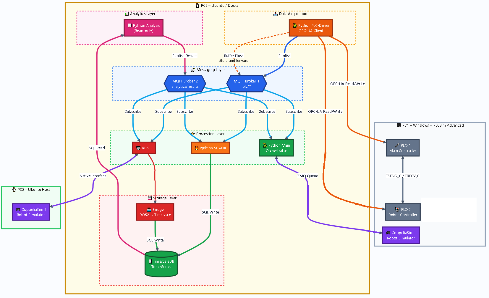

# 🏭 GlassSync - Digital Twin Platform

> Full Stack: Siemens PLC → Python → CoppeliaSim → ROS2/MoveIt2

## 📌 About The Project

GlassSync is a hardware-in-the-loop (HIL) digital twin for a 6-robot glass factory, connecting Siemens S7-1500 PLC, CoppeliaSim simulation, ROS2 + MoveIt2 for motion planning, and Python middleware for OPC UA, ZMQ, and MQTT bridges.

Current Focus: Asset Administration Shell (AAS) + SCL Code for ABB IRB 4600 robot.

## 🎬 Video Documentation

| # | Phase | Topic | Date | Video | Status |
|---|-------|-------|------|-------|--------|
| 1 | Phase 1 | AAS + SCL Integration | 2026-08-21 | [▶️ Watch](https://youtu.be/6XjenCZ8NH8) | ✅ Completed |
| 2 | Phase 2 | OPC UA + Python Driver | TBD | [▶️ Watch]() | ⏳ Planned |
| 3 | Phase 3 | MQTT + Messaging Layer | TBD | [▶️ Watch]() | ⏳ Planned |
| 4 | Phase 4 | TimescaleDB + Storage Layer | TBD | [▶️ Watch]() | ⏳ Planned |
| 5 | Phase 5 | ROS2 + CoppeliaSim Integration | TBD | [▶️ Watch]() | ⏳ Planned |
| 6 | Phase 6 | Full Stack Integration + Analytics | TBD | [▶️ Watch]() | ⏳ Planned |

## 🏗️ System Architecture

*Figure 1: GlassSync System Architecture — Siemens PLC ↔ Python Middleware ↔ CoppeliaSim ↔ ROS2/MoveIt2*

## 🔧 Tech Stack

| Layer | Technology | Role |
|-------|-----------|------|
| PLC | Siemens S7-1500T + TIA Portal V17 | Real-time control |
| Communication | OPC UA, ZMQ, PROFINET, MQTT | Data exchange |
| Simulation | CoppeliaSim 4.6+ | Robot environment |
| Robotics | ROS2 Humble + MoveIt2 | Motion planning |
| Middleware | Python 3.12+ (Asyncio) | Bridge services |
| AAS | IDTA (Asset Administration Shell) | Digital twin |
| Database | TimescaleDB | Time-series storage |
| Visualization | Grafana | Dashboards |
| SCADA | Ignition (planned) | HMI |
| Orchestration | Docker, Docker Compose | Infrastructure |

## 📁 Project Structure

GlassSync/
├── README.md
├── .gitignore
│
├── aas/
│   └── GlassSync.json
│
├── plc/
│   ├── scl/
│   │   └── GlassSync.scl
│   └── db/
│       └── GlassSync.db
│
└── docs/
    ├── Engineering_Logbook.md
    └── images/
        └── System_Architecture.png

## ✅ Phase 1 — AAS + SCL Integration

Date: 2026-08-21
Video: https://youtu.be/6XjenCZ8NH8
Tag: phase-1-aas-scl

### What Was Done?

| # | Task | Status | Files |
|---|------|--------|-------|
| 1 | Create AAS for ABB IRB 4600 | ✅ Done | aas/GlassSync.json |
| 2 | Write SCL control logic | ✅ Done | plc/scl/GlassSync.scl |
| 3 | Define Data Block structure | ✅ Done | plc/db/GlassSync.db |

### Key Features

Inputs (from HMI/SCADA):
- EnableAll, EnableKinematics, Auto_Mode
- Vlcty (velocity - mm/s)
- Positions: HomePos, UpTheLinePos, PickUp1/2/3, Pos4Maint
- Triggers: Go2Pos4Maint, Go2HomePos, Stacking2Left/Right
- Stacking Points: 6 points each for Left/Right
- AccessControl (0=ReadOnly, 1=Operator, 2=Maintenance)

Outputs (Feedback from PLC):
- ActPos (actual TCP position)
- Faults: Group_Fault, Axis1-4_Fault
- Dynamic_Speed, Dynamic_Torque, Axis_Power
- Axis_Limits (Min/Max per axis)
- Status: Motion_Active, Emergency_Stop_Active, Error_Code

### New Files Created

aas/GlassSync.json
plc/scl/GlassSync.scl
plc/db/GlassSync.db

### Technical Challenges & Notes

1. **WCS (World Coordinate System) in TIA Portal**:
   - Challenge: Converting coordinates from WCS to Joint Coordinates inside TIA Portal
   - Solution: Using Transformation Matrix in SCL to convert TCP positions to axis angles
   - Note: `Kinematics_1` was used to handle kinematic transformations

2. **PD_TEL3 Data Type** (RobotDB_A1..A4):
   - Challenge: This data is complex and specific to PROFIdrive Telegram 3
   - Decision: Left outside AAS for now, a dedicated Submodel will be added in future phases
   - Note: Requires deep understanding of PROFIdrive protocol for proper integration

3. **Array Handling in SCL**:
   - Challenge: Working with Arrays in SCL, especially Array[1..4] of LReal for positions
   - Solution: Using `#Temp_Transition_Blend` and `#Temp_Transition_Stop` as intermediate variables
   - Note: Positions defined as Array[1..4] to represent [X, Y, Z, A]

4. **OPC UA Mapping**:
   - Challenge: Mapping SCL variables to OPC UA Node IDs
   - Solution: Creating a separate Submodel (OPCUA_Mapping) to document each Node ID
   - Note: Format used: `ns=3;s="ABB-IRB-4600-DB01"."TagName"`

5. **Sequential Motion Control**:
   - Challenge: Implementing sequential motions with transition control between points
   - Solution: Using `BufferMode := 2` for Transition Blending and `BufferMode := 1` for stop
   - Note: Sequence used: `MC_PickUp1` -> `MC_PickUp2` -> `MC_PickUp3` -> stacking points

6. **Access Control Implementation**:
   - Challenge: Implementing different user permissions (ReadOnly, Operator, Maintenance)
   - Solution: Using `AllowedWriteRole` with values (0, 1, 2) in AAS
   - Note: Linked with `AccessControl` in SCL

7. **Initial Trajectory Planning for Realistic Workspace Motion**:
   - Challenge: Designing a basic trajectory that moves the robot within a workspace that closely resembles real-world physical constraints
   - Solution: Defined a set of waypoints (PickUp1, PickUp2, PickUp3, HomePos, UpTheLinePos) that represent safe and reachable positions within the robot's working envelope. Used MC_MoveDirectAbsolute with blending to create smooth continuous motion
   - Note: Trajectory was validated using CoppeliaSim simulation to ensure no collisions or joint limit violations. The approach points were selected to mimic real pickup and stacking operations in a glass factory environment
   - Future Improvement: Will integrate MoveIt2 in Phase 5 for advanced trajectory optimization and collision-free path planning

### Next Steps

- Phase 2: OPC UA + Python Driver
- Phase 3: MQTT + Messaging Layer
- Phase 4: TimescaleDB + Storage Layer
- Phase 5: ROS2 + CoppeliaSim Integration
- Phase 6: Full Stack Integration + Analytics

## 🚀 Getting Started (Phase 1)

### Prerequisites
- TIA Portal V17 (for PLC development)
- PLCSim Advanced V6 (for simulation)
- Git (for version control)

## 📚 Documentation

- Engineering Logbook: docs/Engineering_Logbook.md

## 📬 Contact

GitHub: https://github.com/Nebras4u
YouTube: https://www.youtube.com/playlist?list=PLMadf0IBbtAE

Built for Industry 4.0 — GlassSync © 2026

